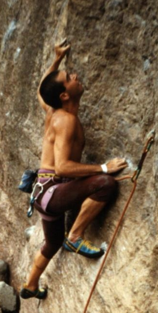

!SLIDE center
# Los programadores no está solos

### En el mundo real hay que tener en cuenta otros roles

!SLIDE incremental
# ¿Quién soy yo?

* Juanje Ojeda [@juanjeojeda](http://www.twitter.com/juanjeojeda)
* He trabajado en empresas de desarrollo software en España y en Irlanda
* Colaboro habitualmente con proyectos libres
* Miembro del comité evaluador del concurso desde el primer año

!SLIDE bullets center incremental
# Tengo un pasado oscuro
## Fuí estudiante de Ciencias del Deporte

* 

!SLIDE bullets center incremental
# Luego no mejoró la cosa...

* 

!SLIDE incremental
# ¿De qué les voy a hablar?

* Les presentaré diferentes puntos de vista del desarrollo en una empresa de software
* Les mostraré problemas típicos y posibles soluciones
* Les explicaré por qué hay que aprender a «salir de la cueva»
* No hablaré de términos de moda
